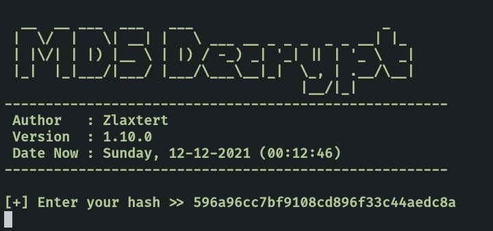

# MD5-Decrypt
PHP CLI
## Install on desktop : 
- Install XAMPP
- Added environment variable system path => C:\xampp\php
- download the script and save it in your folder
- open CMD and running

## Install on android (Termux)
    $ pkg install git
    $ pkg install php
    $ git clone https://github.com/Zlaxtert/MD5-Decrypt
    $ cd MD5-Decrypt
    $ php md5.php

## Screenshot

